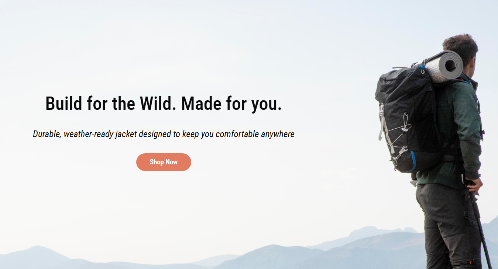

# HTML & CSS Course Assignment - Rainy Days

A frontend project built as part of my studies at Noroff, focused on translating a Figma design into a fully functional website and responsive design using only HTML and CSS.

## Description

Rainy Days is an online store selling outdoor clothing for people who love spending time outside regardless of the weather. The main purpose of this project was to design a complete website in Figma from scratch and then bring that design to life, including responsive design, using only HTML and CSS.

- Designed a full high-fidelity prototype in Figma independently
- Translated the Figma design into 6-pages website
- Focused on layout accuracy, typography, spacing, and consistency
- Built fully responsive across mobile, tablet, and desktop

## Built with

- HTML
- CSS (Flexbox, Media Queries)
- Figma

## What I learned

- Gained a much deeper understanding of CSS Flexbox and how to use
  it to recreate complex layouts
- Learned how to structure HTML semantically across multiple pages
  while keeping the codebase consistent and readable
- Developed a stronger eye for spacing, alignment, and typography
  when working directly in code
- Understood the importance of starting with mobile-first design
  and building up with media queries
- Learned how small design decisions in Figma — like padding and
  font sizes — need careful thought when translated into CSS

## Future Improvement

If I were to continue developing this project, I would focus on:

- Improving performance by optimising image sizes and formats
- Expanding the product pages with more detailed information
  and image galleries
- Adding form validation on the contact page
- Improving accessibility further by reviewing keyboard
  navigation and screen reader support

## Live website:

https://lee-wong13.github.io/html-css-ada/
